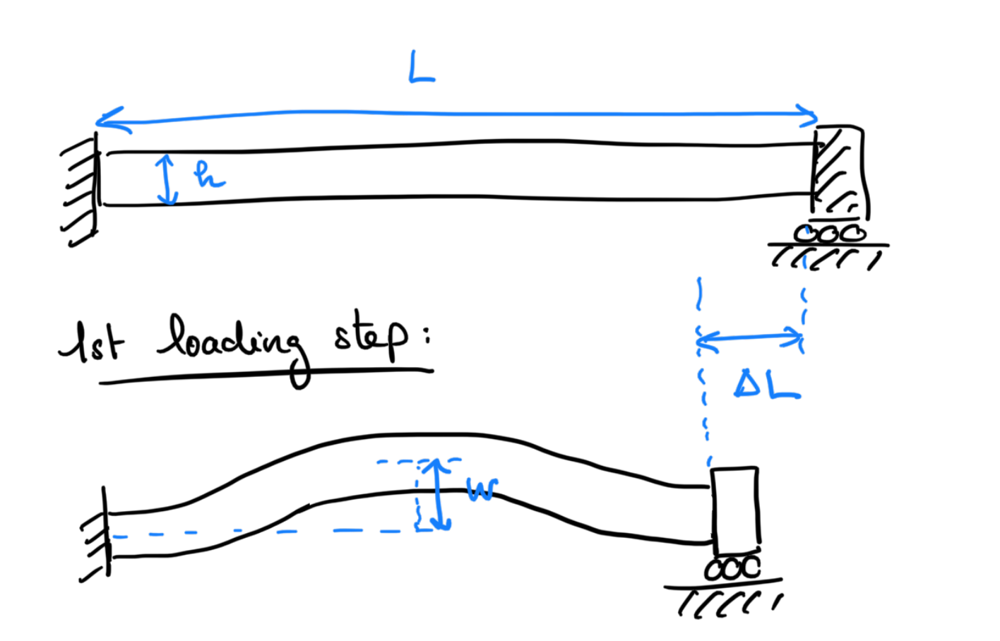
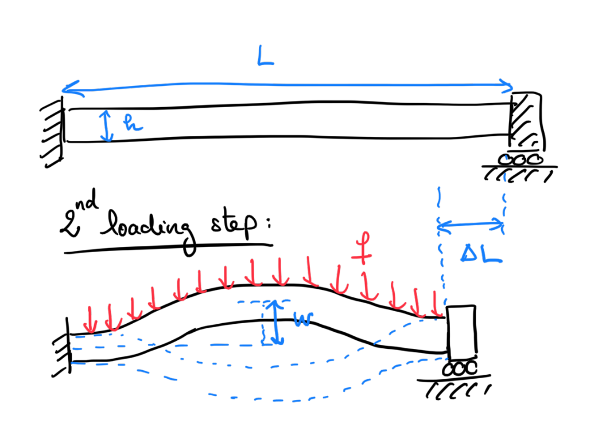

#  Report 2 - Part I: Statics
*MU5MES01 - 2024/25 - C.Lestringant, D.Duhamel, S. Neukirch*

The key concepts introduced in the second part of the class are

- Introduction to nonlinear elasticity
- FEniCSx implementation of a non-linear elastic model
- Use of a Newton solver for the solution of nonlinear problems
- Solution of quasi-static rate-independent problems by load-stepping (progressive increment of a single loading parameter)
- Discussion of the issues arising in the numerical solutions of nonlinear systems: possible non-convergence, convergence to an unstable solution, need for the introduction of imperfections, etc…


Your report should summarize and present synthetically your work on these items using the classical example of snapping of a beam as a model problem. We give below some hints on how to write the report. Personal analyses and comments are particularly welcome. You are not obliged to follow the questions step by step, but you should include in your report the key concepts and results.


**Some suggestions:**

- Write concisely and effectively.
- Comment your results.
- The quality of the figures is important.
- Report only the minimal number of figures (of excellent quality) to effectively communicate your results.
- You can write in English or French.
- Use Latex for writing your report.
- In the written report you should correctly formulate each mathematical problem solved but you should not report all the details of the derivation of the formulation. You will be asked about that during the oral examination.

**Important informations:**
  - Deadline: **Wednesday 12 December 2024, 11pm**.
  - **The maximal length of the report is 4 pages (plus a title page).**
  - To submit your report:
      - An electronic version should be uploaded on [moodle](https://moodle-sciences-23.sorbonne-universite.fr/course/view.php?id=2359), it should include
          1. your report in pdf format named as `MES01-CR2-studentname1-studentname2.pdf` (file with a different naming scheme will not be accepted and evaluated).
          2. the code/files you used to obtain your results, namely the *.py and/or *.ipynb files.
  - We will evaluate the quality of the presentation (language, typesetting, and figures). Being able to effectively communicate your results is important for your future.
  - Consider the questions marked with (#) *only* if you are sufficiently advanced with the other questions; these questions are not required if you are aiming at marks < 12/20.

# Nonlinear snapping of a beam

This project aims at numerically studying the dynamics of the snapping instability of a beam and compare the finite element solutions with the experimental results detailed in [1] (the reference can be found in the github folder). We advise you to start by taking a look at the paper (you don't need to go through all the details).

In your simulations, you will consider a 2D  hyperelastic, rectangular beam (length: $L$, cross-section: $h$), clamped at both ends. We recommend you use a neo-Hookean hyperelastic model with rescaled Young's modulus $E=1$ and Poisson's ratio $\nu=0.25$.

## Part 1. First loading step: axial buckling

Following [1], we start by studying the mechanical response of the structure subject to an axial shortening $\Delta L$ (see Figure below). 

![Experiment in Pandey et al. [1]](load1-manip.png)

**Question 1.1:** Using 1D beam theory, compute the (expected) critical axial force upon which the structure will buckle, and the associated displacement.

**Question 1.2:** Start from the example code in `hyperelasticity_given_to_class.ipynb`. Implement the axial shortening within fenicsx. To this end, we provide an example of how to implement varying Dirichlet Boundary conditions within fenicsx.


```
right_dofs = dolfinx.fem.locate_dofs_geometrical(V, right)
u_prescribed = dolfinx.fem.Constant(my_domain, dolfinx.default_scalar_type(0., 0.))
dolfinx.fem.dirichletbc(u_prescribed,right_dofs,V)
```
 You can later assign the value of the imposed displacement along the direction $x$ to a new value `new_value` by using 

```
 u_prescribed.value = (new_value,0.0)
```
Test your implementation by applying a small end-shortening $\Delta L=0.01$.

**Question 1.3:** Increase $\Delta L$ slowly until the beam buckles. Make sure you help the solver converge by (i) initializing each loadstep with the solution of the previous loadstep and (ii) providing a small imperfection, typically a tiny transverse volumetric force `f` of amplitude $f=0.0001$.

```
f = dolfinx.fem.Constant(my_domain, dolfinx.default_scalar_type((0, 0)))
potential_energy = psi*dx - ufl.inner(u, f)*dx
f.value[1] = 0.0001
```




**Question 1.4:** Plot the bifurcation diagram $w=w(\Delta L)$, where $w$ denotes the transverse displacement at the midpoint of the beam ($x=L/2$, $y=0$). How does the amplitude of the imperfection $f$ influence the bifurcation diagram? Is the prediction from Question 1.1 correct?

**Question 1.5(#):** What happens when you remove the imperfection by setting 
```
f.value[1] = 0.0
``` 
and try to unload the structure (by slowly decreasing $\Delta L$)? Plot the diagram $w(\Delta L)$ and compare with your answer to the previous question.

For parts 2 and 3 below, we will always use a solution of this first loading step as an initial guess. Make sure you save your final solution in a separate variable `u_saved` using

```
u_saved = dolfinx.fem.Function(V)
u_saved.x.array[:] = u.x.array
```

## Part 2. Second loading step: quasi-static snap-through

Next, the endpoints are kept fixed (i.e. $\Delta L$ is fixed to a given value) while the transverse volumetric force $f$ is progressively decreased to negative values, pulling the beam in the direction opposite to the buckling direction. This is illustrated by the red arrows on the figure below. We start by computing quasi-static solutions, before moving to a dynamic solver. Start with a small value of $\Delta L$ (typically a few %, you can try $\Delta L=0.05$).



**Question 2.1:** Set $f=0$ and then decrease the force slowly (increment the force with negative values). Use the saved solution `u_saved` as the initial solution in your loading loop using 

```
u.x.array[:] = u_saved.x.array
```

**Question 2.2:** Plot the bifurcation diagram $w(f)$ and explain what happens. Identify the critical load $f_c$ at which the beam snaps. 

**Question 2.3 (#):** Try increasing (progressively!) the value of $\Delta L$ (typically to $\Delta L=0.08$). How does the critical load $f_c$ vary? Does the solver always converge?

**Question 2.4 (#):** After snapping has taken place, try to unload the structure by slowly increasing the transverse load $f$ until it takes the value $f=0$ and then increase it progressively further to positive values until the structure snaps back. Is the response of the structure symmetric?

## References

[1] Dynamics of snapping beams and jumping poppers, Pandey, A., Moulton, D. E., Vella, D. and Holmes, D. P., Europhysics Letters 105 (2014)


<!-- Local Variables: -->
<!-- fill-column: 80 -->
<!-- End: -->
